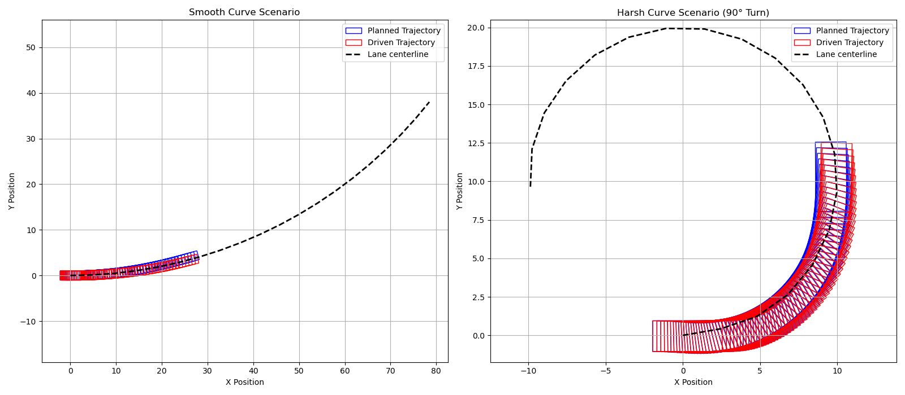

# Trust Region Model Predictive Control 
This repository contains a **Model Predictive Control (MPC)** solver based on a **Trust Region** optimizer.
This repository is still a work in progress.

## Installation and setup:
To install and run this project locally, follow these steps:

### 1. Clone the Repository
First, clone the repository to your local machine:
```bash
git clone https://github.com/giovannilucente/mpc_solver.git
cd mpc_solver
```

### 2. Install Python Dependencies
Install all the required dependencies listed in the requirements.txt, for the python file used for plotting:
```bash
pip install -r requirements.txt
```

### 3. Install C++ Dependencies

**Linux(Ubuntu/Debian)**
```bash
sudo apt update
sudo apt install libeigen3-dev cmake g++
```

**Mac (Homebrew)**
```bash
brew install eigen cmake
```

**Windows (vcpkg)**
```bash
vcpkg install eigen3
```

### 4. Build and Run the Project (CMake)
**Linux / macOS**
```bash
mkdir -p build
bash build_and_run.sh
```
**Windows**
```bash
mkdir build
cd build
cmake ..
make
./mpc_solver
cd ..
python3 plot_trajectories.py
```
If everything works, you should see the plot of the computed trajectories in two different scenarios:

Some information, including the trajectory points, are printed in the terminal.
To create a new scenario to test, please refer to the main.cpp file, where the two scenarios above mentioned are created.
